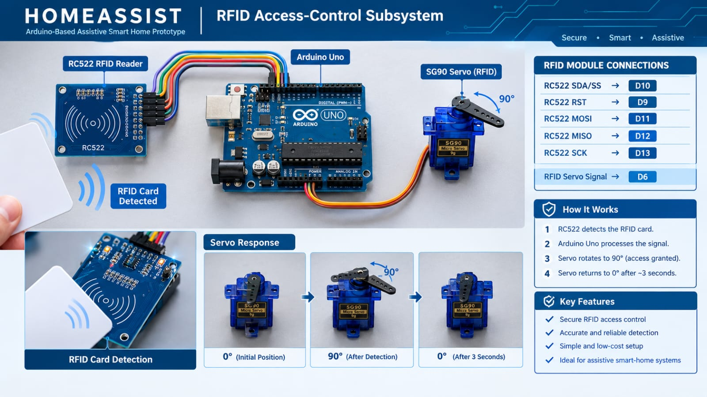

# HOMEASSIST

### An Integrated Smart Home Automation, Security and Safety Prototype

---

## 1. INTRODUCTION

HomeAssist is an integrated smart-home prototype developed to demonstrate how a microcontroller can coordinate different sensors, input devices, communication modules, and actuators to create a connected and automated home environment.

The project combines security, environmental monitoring, safety detection, automatic control, and user interaction into a single prototype. Instead of treating each application as an independent circuit, HomeAssist demonstrates how multiple functions can work together through a common control system.

The prototype is designed as a hands-on embedded-systems project, focusing on sensor interfacing, actuator control, communication, automation logic, and real-time status indication.

---

## 2. PROJECT OBJECTIVES

The main objectives of HomeAssist are:

- To develop a multi-functional smart-home prototype.
- To understand practical sensor interfacing with a microcontroller.
- To implement basic home-security features.
- To automate lighting and other household functions.
- To monitor environmental parameters.
- To provide warning indications for safety-related conditions.
- To explore wired and wireless communication.
- To integrate multiple hardware modules into one working system.
- To gain practical experience in embedded-system development and circuit integration.

---

## 3. KEY FEATURES

### Security and Access Control

- RFID-based identification
- Keypad-based user input
- LCD-based access/status display
- Servo-controlled door mechanism

### Environmental Monitoring

- Temperature measurement
- Humidity measurement
- Ambient light detection
- Rain detection

### Safety Monitoring

- Gas detection
- Flame detection
- Warning indication using LEDs/buzzer

### Automation

- Automatic lighting
- Distance-based detection
- Automatic window-control concept
- Relay-based appliance control

### Communication

- Bluetooth-based control using HC-05
- Wi-Fi connectivity using ESP8266
- LCD interface for local system information

---

# 4. SYSTEM ARCHITECTURE

The HomeAssist system follows a simple input-processing-output architecture.

```text
                         HOMEASSIST
                             |
              +--------------+--------------+
              |                             |
           INPUTS                       CONTROLLER
              |                             |
     +--------+---------+             Arduino
     |        |         |                  |
   Sensors  RFID      Keypad               |
     |        |         |                  |
     +--------+---------+------------------+
                              |
                    +---------+---------+
                    |                   |
                 OUTPUTS           COMMUNICATION
                    |                   |
             +------+-------+       +---+----+
             |      |       |       |        |
           Servo   Relay   Buzzer   HC-05   ESP8266
             |      |       |
          Door   Appliance  Alert

# 5. HARDWARE COMPONENTS

HomeAssist combines multiple sensors, input devices, communication modules, displays, and actuators to implement different smart-home functions.

| Component | Purpose |
|---|---|
| Arduino | Main controller for processing inputs and controlling outputs |
| LCD | Displays system information, readings, and status messages |
| 4×4 Keypad | Provides user input for access and control |
| RFID Module | Provides contactless identification |
| Servo Motor | Used for door or window automation |
| LDR | Detects surrounding light intensity |
| DHT11 | Measures temperature and humidity |
| MQ Sensor | Detects changes in gas concentration |
| Flame Sensor | Detects the presence of a flame |
| Rain Sensor | Detects rainfall or water presence |
| HC-SR04 | Measures the distance of nearby objects |
| HC-05 | Provides Bluetooth communication |
| ESP8266 | Provides Wi-Fi connectivity |
| Relay Module | Controls suitable external loads |
| Buzzer | Provides audible warning indication |
| LEDs | Provides visual status indication |

---

# 6. SECURITY AND ACCESS CONTROL

## 6.1 RFID-BASED ACCESS

The RFID module is used to demonstrate contactless identification for the smart-door section of HomeAssist.

When an RFID card or tag is presented to the reader, the module communicates the identification information to the Arduino. The controller processes the received information and determines the appropriate access response.

A servo motor can then be used to represent the operation of an electronic door-lock mechanism.



### Working Flow

```text
RFID Card / Tag
       ↓
RFID Reader
       ↓
Arduino
       ↓
Identification Check
       ↓
Servo Motor
       ↓
Door Lock Mechanism
6.2 RFID TESTING
The RFID module was tested separately before integrating it with the complete HomeAssist prototype. Individual testing helps verify module communication and operation before system-level integration.
�
6.3 KEYPAD-BASED ACCESS
The 4×4 keypad provides a user-input interface for password-based access control.
The user can enter a predefined password through the keypad. The Arduino processes the entered sequence and can provide feedback through the LCD and control the servo according to the programmed logic.
User Input
    ↓
4×4 Keypad
    ↓
Arduino
    ↓
Password Verification
    ↓
Access Decision
    ↓
LCD + Servo
7. LCD DISPLAY AND USER INTERFACE
The LCD provides a local interface between the user and the HomeAssist system.
It can be used to display:
Access information
Sensor readings
Warning messages
System status
User prompts
Control responses
The display allows important information to be viewed directly from the prototype without requiring a separate computer.
8. AUTOMATIC LIGHT CONTROL
The LDR is used to detect changes in the surrounding light intensity.
The resistance of an LDR varies according to the amount of light falling on its surface. The Arduino reads the corresponding sensor signal and uses programmed conditions to control the lighting output.
The concept can be used for automatic lighting in rooms, corridors, entrances, and other areas.
Ambient Light
      ↓
     LDR
      ↓
Arduino
      ↓
Light-Level Decision
      ↓
Lighting Output
9. TEMPERATURE AND HUMIDITY MONITORING
The DHT11 sensor is used to monitor environmental temperature and relative humidity.
The sensor provides digital measurements to the Arduino, which can process and display the readings through the LCD.
This module demonstrates basic environmental monitoring within a smart-home system.
10. GAS DETECTION AND WARNING
The MQ-series gas sensor is used to demonstrate gas detection within the HomeAssist prototype.
The sensor responds to changes in gas concentration, and the Arduino can process the sensor output to determine whether a warning condition has been detected.
The warning can be indicated through:
Buzzer
LED
LCD message
This prototype demonstrates the concept of gas monitoring and warning; it is not intended to replace certified household gas-safety equipment.
11. FLAME DETECTION
The flame sensor is used to detect the presence of a flame within its sensing range.
When a flame condition is detected, the Arduino can activate an appropriate warning output such as a buzzer, LED, or LCD message.
Flame
  ↓
Flame Sensor
  ↓
Arduino
  ↓
Detection Logic
  ↓
Warning Output
�
12. RAIN DETECTION AND AUTOMATIC WINDOW CONTROL
The rain sensor detects the presence of water on its sensing surface.
The Arduino can process the sensor output and control a servo mechanism to demonstrate an automated window system.
Rain Detection
      ↓
Rain Sensor
      ↓
Arduino
      ↓
Control Decision
      ↓
Servo Motor
      ↓
Window Mechanism
This demonstrates how environmental conditions can be used to trigger automatic mechanical actions.
13. ULTRASONIC DISTANCE DETECTION
The HC-SR04 ultrasonic sensor is used for non-contact distance measurement.
The sensor sends an ultrasonic pulse and measures the time taken for the reflected signal to return. The Arduino uses this timing information to calculate the approximate distance of an object.
The measured distance can then be used for proximity-based automation.
HC-SR04
   ↓
Ultrasonic Measurement
   ↓
Arduino
   ↓
Distance Calculation
   ↓
Control / Indication
14. BLUETOOTH CONTROL
The HC-05 Bluetooth module provides short-range wireless communication between the HomeAssist system and a compatible mobile device.
Bluetooth communication can be used to send commands to the controller and provide wireless control of selected functions.
This demonstrates the integration of wireless communication into an embedded automation system.
15. WI-FI CONNECTIVITY
The ESP8266 is used to demonstrate Wi-Fi connectivity.
The addition of Wi-Fi provides a foundation for extending HomeAssist toward IoT-based applications such as:
Remote monitoring
Web-based dashboards
Cloud data logging
Remote control
Notification systems
The current prototype provides the basic hardware foundation for these future extensions.
16. RELAY-BASED APPLIANCE CONTROL
A relay module provides an interface between the Arduino and a suitable external load.
The Arduino can control the relay according to programmed conditions, demonstrating the basic concept of automated appliance switching.
For safe testing, suitable low-voltage loads should be used unless proper electrical isolation and safety procedures are followed.
17. CIRCUIT IMPLEMENTATION
The different modules were integrated progressively to develop the HomeAssist prototype.
During circuit development, attention was given to:
Power connections
Ground connections
Sensor interfaces
Digital input/output connections
Communication interfaces
Actuator connections
Physical module arrangement
�
18. SYSTEM SCHEMATIC
The schematic represents the electrical connections and interaction between the major components used in the HomeAssist system.
�
19. MODULE DEVELOPMENT
The prototype was developed through individual module testing followed by system integration.
Step 1 — Individual Testing
Each sensor and module was tested separately to understand its operation and verify its response.
Step 2 — Controller Integration
The modules were connected to the Arduino and programmed according to their respective functions.
Step 3 — Functional Testing
Individual functions such as RFID access, sensor detection, display operation, and actuator control were tested.
Step 4 — System Integration
Multiple modules were combined to form the integrated HomeAssist prototype.
Step 5 — Final Assembly
The tested modules were arranged into the final prototype for demonstration.
�
20. TESTING AND VALIDATION
The individual modules were tested to verify their basic functionality before and after integration.
Module
Test
Expected Operation
RFID
Card/tag detection
Identification received
Keypad
Key input
User input detected
LCD
Display test
Information displayed
LDR
Light variation
Lighting response changes
DHT11
Temperature/humidity test
Environmental readings obtained
MQ Sensor
Gas response
Warning condition detected
Flame Sensor
Flame detection
Warning activated
Rain Sensor
Water detection
Rain condition detected
HC-SR04
Object detection
Distance measured
Servo
Position control
Servo moves as programmed
Relay
Switching test
Relay changes state
HC-05
Bluetooth test
Wireless communication established
ESP8266
Wi-Fi test
Wireless connection established
21. FINAL PROTOTYPE
The final prototype combines the tested modules into a single smart-home demonstration system.
It demonstrates the integration of sensing, processing, communication, user interaction, and actuation within an embedded platform.
�
22. ADDITIONAL DEVELOPMENT IMAGES
Hardware Arrangement
�
PCB Testing
�
23. APPLICATIONS
The concepts demonstrated by HomeAssist can be applied to:
Residential automation
Smart-room systems
Electronic access control
Environmental monitoring
Automatic lighting
Safety monitoring
Appliance automation
IoT-based home monitoring
Educational embedded-system projects
24. CHALLENGES AND LEARNING
Developing a multi-module embedded system requires careful hardware and software integration.
Some of the important practical areas explored during development include:
Sensor interfacing
Module communication
Pin management
Power and ground connections
Actuator control
Hardware troubleshooting
Software debugging
Combining multiple functions into one controller
Testing individual modules before complete integration
25. FUTURE ENHANCEMENTS
The HomeAssist prototype can be further extended with:
Dedicated mobile application
Cloud-based monitoring
Web dashboard
Real-time notifications
Voice-controlled automation
Data logging
Historical sensor-data visualization
Improved user authentication
Remote appliance control
Improved enclosure design
Custom PCB development
Additional IoT capabilities
26. LEARNING OUTCOMES
This project provided practical exposure to:
Microcontroller programming
Sensor interfacing
Digital and analog signals
LCD interfacing
Keypad interfacing
RFID communication
Servo motor control
Relay control
Bluetooth communication
Wi-Fi connectivity
Embedded-system integration
Circuit testing
Hardware troubleshooting
Basic IoT concepts
27. PROJECT STATUS
Status: Working Prototype
HomeAssist is currently developed as an educational smart-home prototype demonstrating multiple automation, security, monitoring, and safety concepts.
The system can be further developed into a more connected IoT platform through additional software, communication, data-logging, and hardware improvements.
28. CONCLUSION
HomeAssist demonstrates how different electronic modules can be integrated around a microcontroller to create a multifunctional smart-home prototype.
The project combines security, environmental monitoring, safety detection, automation, wireless communication, and user interaction within a single platform.
The development process provides practical experience in connecting hardware components, programming control logic, testing individual modules, troubleshooting circuits, and integrating multiple embedded functions into a unified system.
29. PROJECT STRUCTURE
HomeAssist/
│
├── README.md
├── LICENSE
│
├── block.jpeg
├── circuit.jpeg
├── final.jpeg
├── flame.jpeg
├── frame.jpeg
├── module.jpeg
├── pcb-testing.jpeg
├── rfid.jpeg
├── rfid testing.jpeg
└── schematic.jpeg
30. TECHNOLOGIES AND CONCEPTS
Microcontroller: Arduino
Programming: Arduino / Embedded C
Sensors: LDR, DHT11, MQ Sensor, Flame Sensor, Rain Sensor, HC-SR04
Security: RFID, 4×4 Keypad
Actuators: Servo Motor, Relay, Buzzer, LEDs
Communication: HC-05 Bluetooth, ESP8266 Wi-Fi
Display: LCD
Domain: Embedded Systems, Smart Home Automation and IoT
31. LICENSE
This project is intended for educational and learning purposes.
See the LICENSE file for the applicable license information.
