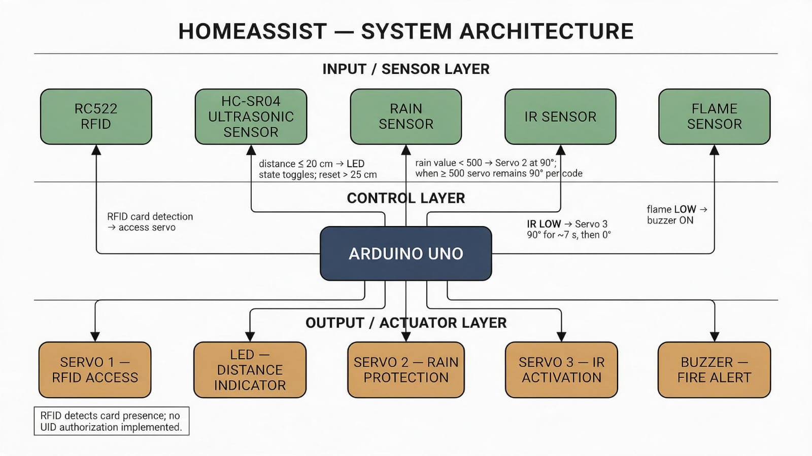
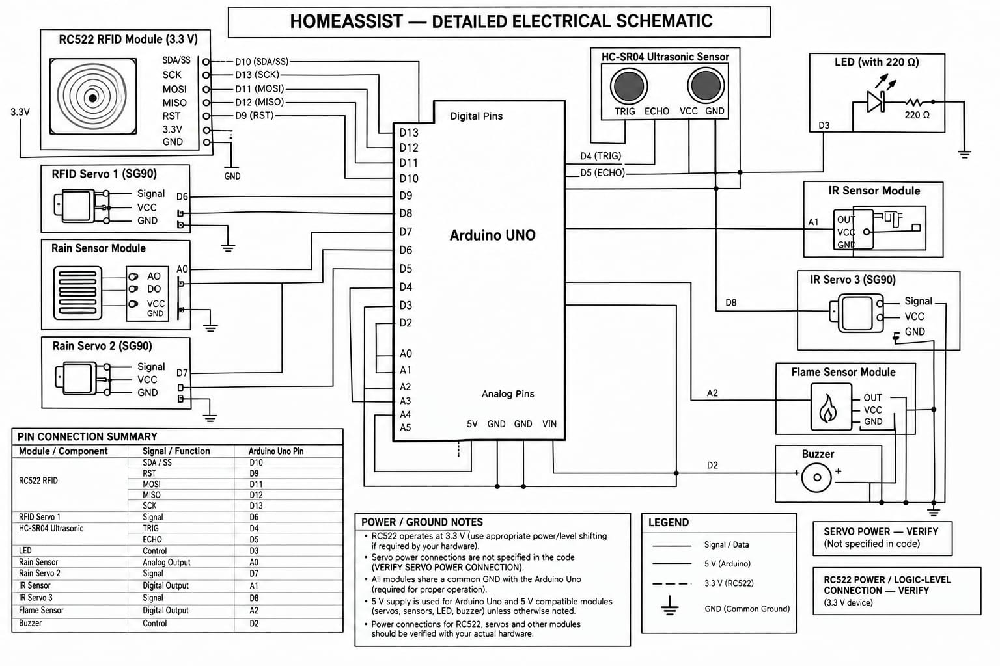
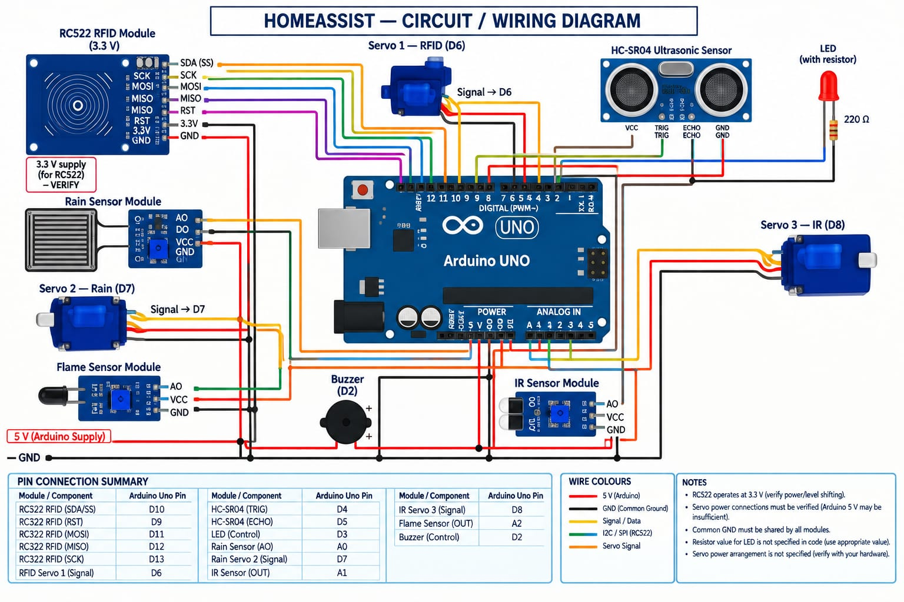
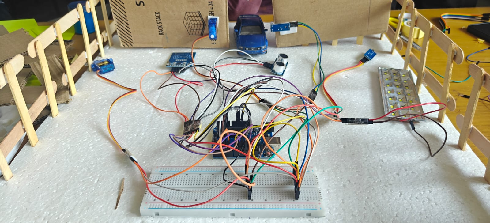
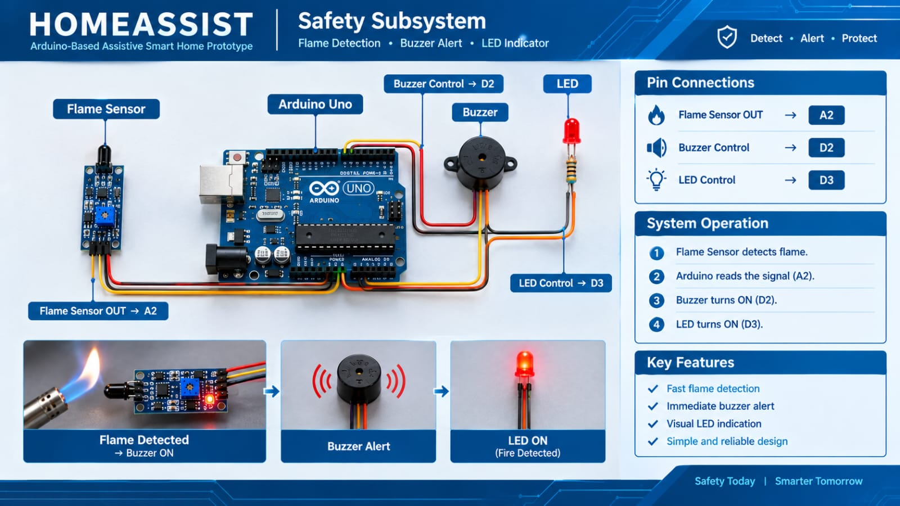
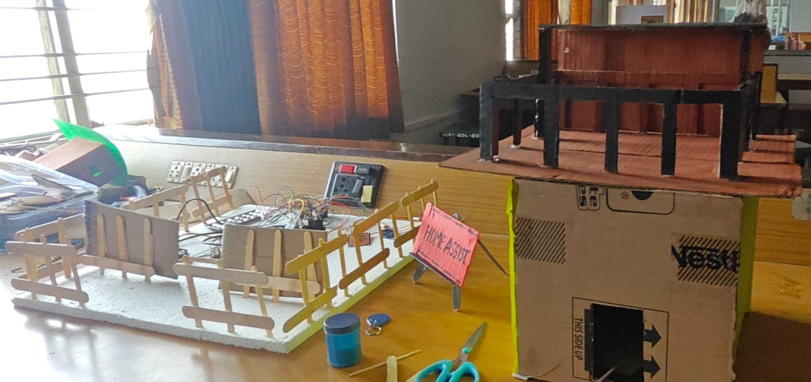

#    **HOMEASSIST — ASSISTIVE SMART HOME AUTOMATION SYSTEM**

---

# **1\. TITLE PAGE**

**HOMEASSIST**

**Assistive Smart Home Automation System**

A Prototype Developed During Electronics and Embedded Systems Training

---

# **2\. ABSTRACT**

HomeAssist is an Arduino Uno–based assistive smart home automation prototype developed to demonstrate the integration of multiple sensing and actuation modules within a single embedded control system. The system combines RFID-based card detection with servo-actuated access response, ultrasonic distance sensing with LED indication, rain detection with automated servo response, infrared-based detection with timed servo actuation, and flame detection with an audible buzzer alert.

Each module uses dedicated Arduino input/output interfaces, while the module logic is sequentially evaluated within a continuously executing control loop. The project was developed through an iterative, modular assembly and testing methodology, in which each functional section was independently wired, tested, and verified before integration into the complete system.

During development, a hardware issue in the RFID module's physical connections was identified and corrected through systematic inspection and securing of the connections. This reinforced the importance of hardware-level verification alongside software debugging. The project also demonstrated the importance of validating AI-assisted circuit information against datasheets, official documentation, reliable technical references, and practical hardware testing.

HomeAssist is presented strictly as a student prototype intended for learning and demonstration purposes. It is not claimed to be commercially deployed, industrially certified, or production-ready.

---

# **3\. INTRODUCTION**

Smart home automation provides a practical application area for embedded systems, allowing students to explore sensor interfacing, actuator control, microcontroller programming, and system integration. HomeAssist was developed as a hands-on prototype to investigate how multiple independent sensing and response mechanisms can be combined within a single Arduino-based control system.

The project focuses on five functional areas: RFID-based card detection paired with a servo-actuated mechanism, ultrasonic-based distance detection with LED response, rain detection with automated servo response, infrared-based detection with timed servo actuation, and flame detection with buzzer-based alerting.

Rather than functioning as a fully integrated commercial access-control or safety system, HomeAssist serves as an educational demonstration of how discrete sensor-actuator subsystems can be interfaced with a microcontroller and coordinated through embedded software.

This documentation presents the system architecture, hardware and software implementation, pin configuration, module operation, development methodology, troubleshooting process, testing approach, limitations, and engineering lessons learned during the project.

---

# **4\. PROBLEM STATEMENT**

Manual operation of certain home functions can be inconvenient, particularly when repeated physical interaction is required. There is a need for low-cost prototype-level demonstrations showing how embedded sensing and actuation can be used to automate basic functions such as access detection, proximity indication, rain response, object detection, and flame alerting.

HomeAssist addresses this requirement at a student-prototype level by integrating multiple sensor-actuator modules into a centralized Arduino-based system.

The project focuses on demonstrating the technical principles of sensor acquisition, threshold-based decision making, actuator control, timing, and modular embedded-system integration.

---

# **5\. OBJECTIVES**

* To design and implement an Arduino Uno–based prototype integrating RFID detection, ultrasonic sensing, rain detection, infrared detection, and flame detection.  
* To interface each sensing module with an appropriate actuator such as a servo motor, LED, or buzzer.  
* To implement sensor-based control logic using Arduino programming.  
* To develop and test each functional module independently before integrating the complete system.  
* To identify and resolve hardware-level issues through systematic troubleshooting.  
* To apply verified technical references and practical testing when validating circuit connections.  
* To document the complete system in a technically accurate format suitable for academic evaluation and GitHub presentation.

---

# **6\. SYSTEM OVERVIEW**

HomeAssist is built around a single Arduino Uno microcontroller. The controller sequentially evaluates five independent functional modules within its continuously executing loop() function.

### **Functional Modules**

**1\. RFID Access Detection Module**  
 Detects an RFID card using an RC522 reader and actuates a dedicated servo motor.

**2\. Ultrasonic Distance and LED Module**  
 Measures distance using an HC-SR04 sensor and toggles an LED according to the programmed proximity logic.

**3\. Rain Detection and Servo Module**  
 Reads an analog rain-sensor value and actuates a dedicated servo when the programmed rain threshold is crossed.

**4\. IR Detection and Servo Module**  
 Detects a LOW digital output from an IR sensor and actuates a dedicated servo for a timed interval.

**5\. Flame Detection and Buzzer Module**  
 Detects a LOW digital output from a flame sensor and activates an audible buzzer.

The system does **not use an LCD or any other display module**.

During development, Serial Monitor messages were used for software debugging and operational observation.

**Figure 1\. System Architecture of the HomeAssist Assistive Smart Home Automation System.**

---

# **7\. SYSTEM ARCHITECTURE**

HomeAssist follows a centralized single-controller architecture in which the Arduino Uno serves as the primary processing unit.

The system consists of three logical layers.

### **7.1 Input Layer**

The input layer contains:

* RC522 RFID reader using SPI communication  
* HC-SR04 ultrasonic sensor  
* Rain sensor using analog input  
* IR sensor using digital input  
* Flame sensor using digital input

### **7.2 Processing Layer**

The Arduino Uno:

* receives sensor inputs,  
* evaluates programmed conditions,  
* calculates ultrasonic distance,  
* compares the rain-sensor value with a threshold,  
* controls timing for servo responses,  
* and generates actuator outputs.

### **7.3 Output Layer**

The output layer consists of:

* RFID Servo — D6  
* LED — D3  
* Rain Servo — D7  
* IR Servo — D8  
* Buzzer — D2

The modules are not processed simultaneously by separate controllers. Instead, their logic is **sequentially evaluated during repeated executions of the Arduino loop() function**.

                 **Figure 2\. Final Circuit Configuration of the HomeAssist Prototype.**

                     **Figure 3\. Schematic Representation of the HomeAssist System.**

---

# **8\. HARDWARE REQUIREMENTS**

| Component | Function |
| ----- | ----- |
| Arduino Uno | Main controller for the complete system |
| RC522 RFID Module | Detects RFID cards using SPI communication |
| Servo Motor 1 | Actuates in response to RFID card detection |
| HC-SR04 Ultrasonic Sensor | Measures distance for proximity detection |
| LED | Indicates the ultrasonic detection state |
| Rain Sensor Module | Provides an analog rain-related reading |
| Servo Motor 2 | Actuates in response to the programmed rain condition |
| IR Sensor Module | Provides digital detection input |
| Servo Motor 3 | Actuates in response to IR detection |
| Flame Sensor Module | Provides digital flame-detection input |
| Buzzer | Provides audible indication during flame detection |
| Jumper Wires / Breadboard / Prototyping Hardware | Circuit assembly and interconnection |

### **Power Configuration Note**

The Arduino source code establishes the signal assignments but does not establish the complete physical power architecture.

Therefore, the exact:

* VCC connections,  
* GND connections,  
* servo power source,  
* external supply arrangement,  
* and RC522 logic-level arrangement

should be documented only after verification against the actual prototype and reliable component documentation.

---

# **9\. SOFTWARE REQUIREMENTS**

| Software / Library | Purpose |
| ----- | ----- |
| Arduino IDE | Firmware development and upload environment |
| SPI Library | Provides SPI communication support for the RC522 |
| MFRC522 Library | Provides RC522 RFID reader functions |
| Servo Library | Controls the three servo motors |

### **Libraries Included**

\#include \<SPI.h\>  
\#include \<MFRC522.h\>  
\#include \<Servo.h\>  
---

# **10\. PIN CONFIGURATION**

The following table is derived directly from the Arduino source code.

| Module | Signal / Function | Arduino Uno Pin |
| ----- | ----- | ----- |
| RC522 RFID | SDA / SS | D10 |
| RC522 RFID | RST | D9 |
| RC522 RFID | MOSI | D11 |
| RC522 RFID | MISO | D12 |
| RC522 RFID | SCK | D13 |
| RFID Servo — Servo 1 | Signal | D6 |
| HC-SR04 | TRIG | D4 |
| HC-SR04 | ECHO | D5 |
| LED | Control | D3 |
| Rain Sensor | Analog Output | A0 |
| Rain Servo — Servo 2 | Signal | D7 |
| IR Sensor | Digital Output | A1 |
| IR Servo — Servo 3 | Signal | D8 |
| Flame Sensor | Digital Output | A2 |
| Buzzer | Control | D2 |

### **Important Pin Verification**

The Arduino code directly establishes the following assignments:

* RFID Servo → D6  
* Rain Servo → D7  
* IR Servo → D8  
* HC-SR04 TRIG → D4  
* HC-SR04 ECHO → D5  
* LED → D3  
* Rain Sensor → A0  
* IR Sensor → A1  
* Flame Sensor → A2  
* Buzzer → D2  
* RC522 SS → D10  
* RC522 RST → D9  
* RC522 MOSI → D11  
* RC522 MISO → D12  
* RC522 SCK → D13
  

---

# **11\. MODULE DESCRIPTION AND WORKING PRINCIPLE**

## **11.1 RFID Access Detection Module**

The RC522 RFID reader communicates with the Arduino Uno using the SPI interface.

The RC522 uses:

* SS/SDA → D10  
* RST → D9  
* MOSI → D11  
* MISO → D12  
* SCK → D13

When the RFID reader detects a new card and successfully reads its card serial information, the RFID servo rotates to **90°**.

The program records the activation time using millis(). After approximately **3 seconds**, the servo returns to **0°**.

The RFID communication is then halted and the system resumes normal card detection.

### **Important Functional Limitation**

The current software performs **RFID card detection and serial-number reading only**.

It does **not**:

* compare the card UID against a stored authorized UID,  
* maintain an authorized-card database,  
* reject unauthorized cards.

Therefore, the documentation must describe this module as **RFID card detection with servo actuation**, rather than a fully authenticated access-control system.
 

                   **Figure 3\. RFID Module Testing During Hardware Debugging.**

---

## **11.2 Ultrasonic Distance and LED Module**

The HC-SR04 sensor is used to measure distance.

The Arduino generates a trigger pulse on D4 and measures the returned echo signal on D5.

The software calculates distance using:

Distance \= Echo Duration × 0.0343 / 2

When the calculated distance is **20 cm or less**, and a detection has not already been registered, the LED state is toggled.

When the measured distance becomes **greater than 25 cm**, the ultrasonic detection state is reset.

This creates a **5 cm hysteresis region** between the detection threshold and reset threshold, preventing repeated triggering while an object remains within the detection region.

---

## **11.3 Rain Detection and Servo Module**

The rain sensor provides an analog reading through **A0**.

The program defines:

\#define RAIN\_THRESHOLD 500

When:

**Rain sensor value \< 500**

the system considers the programmed rain condition active and moves Servo 2 to **90°**.

When:

**Rain sensor value ≥ 500**

the rain state is cleared.

However, according to the current implementation, the rain servo **remains at 90°** after the rain state clears. It does not automatically return to 0°.

This behavior must be represented accurately in both the documentation and system diagrams.

---

## **11.4 IR Detection and Servo Module**

The IR sensor is connected to **A1** and is read as a digital input.

When:

**IR sensor output \= LOW**

the IR servo moves to **90°**.

The program then executes:

delay(7000);

The servo therefore remains at approximately 90° for seven seconds.

After this period, the servo returns to **0°**, followed by a 500 ms delay.

Because the implementation uses delay(7000), the main loop is temporarily blocked during this interval.

---

## **11.5 Flame Detection and Buzzer Module**

The flame sensor is connected to **A2**.

When:

**Flame sensor output \= LOW**

the Arduino activates the buzzer through **D2**.

When the flame sensor output is not LOW, the buzzer is switched OFF.

The module therefore provides a basic digital flame-detection indication through an audible output.

---

# **12\. SOFTWARE IMPLEMENTATION**

## **12.1 Library Initialization**

The program uses three libraries:

* SPI.h  
* MFRC522.h  
* Servo.h

The SPI library supports communication with the RC522, the MFRC522 library provides RFID functionality, and the Servo library controls the three servo motors.

---

## **12.2 Initialization — setup()**

The setup() function:

1. Starts Serial communication at **9600 baud**.  
2. Initializes the SPI interface.  
3. Initializes the RC522 RFID reader.  
4. Attaches Servo 1, Servo 2, and Servo 3\.  
5. Sets the initial servo positions to 0°.  
6. Configures the HC-SR04 trigger and echo pins.  
7. Configures the LED output.  
8. Configures the rain sensor input.  
9. Configures the IR sensor input.  
10. Configures the flame sensor input.  
11. Configures the buzzer output.  
12. Sets the LED and buzzer to their initial OFF states.

---

## **12.3 Main Loop Architecture**

The loop() function sequentially evaluates the five functional modules.

### **Step 1 — RFID**

The program checks whether the RFID servo is currently active.

If the three-second period has elapsed, the servo returns to 0°.

Otherwise, when no RFID servo action is active, the program checks for a new RFID card.

---

### **Step 2 — Ultrasonic**

The HC-SR04 is triggered.

The echo duration is measured using:

pulseIn(ECHO\_PIN, HIGH, 30000);

The distance is then calculated.

If the distance is ≤20 cm and the detection state is inactive, the LED state is toggled.

If the distance exceeds 25 cm, the detection state is reset.

---

### **Step 3 — Rain Sensor**

The rain sensor's analog value is read using:

analogRead(RAIN\_PIN);

The result is compared against the threshold of 500\.

The rain servo is controlled according to the implemented rain-state logic.

---

### **Step 4 — IR Sensor**

The Arduino reads the IR sensor.

When the input is LOW:

* Servo 3 moves to 90°.  
* The program waits 7 seconds.  
* Servo 3 returns to 0°.  
* The program waits an additional 500 ms.

This delay() temporarily blocks the remainder of the loop.

---

### **Step 5 — Flame Sensor**

The flame sensor is read digitally.

LOW:

→ Buzzer ON

Not LOW:

→ Buzzer OFF

---

## **12.4 Timing Behavior**

The two servo timing mechanisms are implemented differently.

### **RFID Servo**

The RFID servo uses:

millis()

to measure approximately three seconds without using a seven-second blocking delay.

### **IR Servo**

The IR servo uses:

delay(7000);

to hold the servo at 90° for approximately seven seconds.

Therefore, the RFID and IR timing implementations should **not** be described as using the same timing method.

---

## **12.5 State Variables and Thresholds**

| Variable / Threshold | Purpose |
| ----- | ----- |
| rfidServoActive | Indicates whether the RFID servo is within its active timing period |
| rfidServoStartTime | Stores the RFID servo activation time |
| ledState | Stores the current LED state |
| ultrasonicDetected | Prevents repeated LED toggling before the detection state is reset |
| RAIN\_THRESHOLD \= 500 | Rain-sensor threshold used by the program |
| rainDetected | Stores the current programmed rain-detection state |
| RFID timing ≈ 3 s | Controls RFID servo return |
| IR timing ≈ 7 s | Controls IR servo return |

---

## **12.6 Serial Monitor**

The program initializes Serial communication at:

**9600 baud**

Serial messages are used during development to monitor events such as:

* RFID detection  
* distance measurements  
* rain sensor values  
* rain detection  
* IR detection  
* flame detection  
* servo actions

The Serial Monitor therefore serves as a development and debugging interface.

---

# **13\. DEVELOPMENT METHODOLOGY AND ASSEMBLY APPROACH**

## **13.1 Initial Approach**

The initial development approach attempted to obtain and assemble the complete wiring information for the entire integrated system at once.

Because the project contained multiple sensors, three servo motors, and multiple output devices, attempting to establish the complete circuit simultaneously made the wiring difficult to understand and troubleshoot reliably.

---

## **13.2 Modular Development Approach**

The methodology was therefore changed to an incremental approach.

### **Module 1**

**Assemble → Test → Verify**

### **Module 2**

**Assemble → Test → Verify**

### **Module 3**

**Assemble → Test → Verify**

### **Module 4**

**Assemble → Test → Verify**

### **Module 5**

**Assemble → Test → Verify**

### **Final Stage**

**Integrate → Test Complete System → Verify**

This approach reduced debugging complexity because problems could be isolated to individual functional sections before the complete system was assembled.

**Figure 4\. Modular Assembly, Testing, Verification, and Final System Integration Approach.**

---

## **13.3 Module-Wise Development**

The five functional modules were treated as separate sections:

1. RFID \+ Servo 1  
2. HC-SR04 \+ LED  
3. Rain Sensor \+ Servo 2  
4. IR Sensor \+ Servo 3  
5. Flame Sensor \+ Buzzer

Each section was understood and tested before proceeding toward full integration.

---

## **13.4 Responsible Use of AI and Technical Research**

During the early stages of the project, AI tools were used extensively to assist with circuit connection research.

The development process demonstrated that AI-generated circuit information should not automatically be treated as technically verified information.

The revised engineering workflow therefore emphasized:

* **AI assistance**  
* **Official documentation**  
* **Datasheet**  
* **Reliable technical references**  
* **Practical hardware verification**

AI was retained as a supporting research and learning tool rather than being treated as the sole authority for circuit design decisions.

---

# **14\. TROUBLESHOOTING AND CORRECTIVE ACTIONS**

## **14.1 RFID Module Fault Investigation**

After the integrated circuit was assembled, the other functional sections operated while the RFID section did not respond as expected.

A second access card was tested to determine whether the problem was specific to the original card. The second card also failed to produce the expected RFID response.

The investigation therefore continued beyond the card itself and focused on the RFID module's physical implementation.

The issue was eventually traced to the **physical/soldering connections of the RFID section**.

The connections were corrected and properly secured, after which the RFID section operated as expected.

The exact physical defect is not specified because it was not formally identified as a particular soldering-fault category.

---

## **14.2 Troubleshooting Table**

| Issue | Investigation | Corrective Action | Engineering Lesson |
| ----- | ----- | ----- | ----- |
| RFID module did not detect cards | Software operation was reviewed; a second RFID card was tested; physical connections and soldering were inspected | RFID physical/soldering connections were corrected and properly secured | Hardware-level faults must be considered alongside software faults |
| Complete integrated wiring was difficult to establish initially | Attempted to work with the complete multi-module system simultaneously | Changed to module-by-module assembly and testing | Incremental integration simplifies troubleshooting |
| AI-generated connection information required verification | AI suggestions were compared with technical references and practical hardware behavior | Datasheets, documentation, reliable references, and hardware testing were prioritized | AI should support engineering research rather than replace technical verification |

---

# **15\. TESTING AND VALIDATION**

# The system behavior was reviewed against the implemented Arduino program, including the configured sensor inputs, actuator outputs, thresholds, timing conditions, and Serial Monitor messages. Physical test observations were not recorded during the documentation process; therefore, actual hardware results are not claimed in this report.

### 15.1 CODE-BASED FUNCTIONAL VERIFICATION

| Test ID | Function | Verification Basis	 |  Expected Behavior from                                      Implemented Code  |
| :---- | :---- | :---- | :---- |
| T-01	 | RFID Detection |   Arduino code logic | When an RFID card is detected, Servo 1 rotates to 90° and returns to 0° after approximately 3 seconds.  |
| T-02	 | Ultrasonic Detection | Arduino code logic | When an object is detected at a distance of ≤20 cm, the LED state is toggled.  |
| T-03 | Ultrasonic Reset | Arduino code logic | 	When the measured distance becomes \>25 cm, the ultrasonic detection state is reset, allowing a subsequent detection.  |
| T-04	 | Rain Detection | Arduino code logic	 | When the rain sensor value is below 500, Servo 2 rotates to 90°.  |
| T-05 | Rain State Clearing | Arduino code logic	 | When the rain sensor value reaches 500 or above, the rain detection state is cleared while Servo 2 remains at 90° according to the implemented code.  |
| T-06	 | IR Detection | Arduino code logic	 | When the IR sensor output is LOW, Servo 3 rotates to 90°, remains there for approximately seconds, and then returns to 0°.  |
| T-07 | Flame Detection	 | Arduino code logic | When the flame sensor output is LOW, the buzzer is switched ON.  |
| T-08	 | Flame Clear	 | Arduino code logic | When the flame sensor output is not LOW, the buzzer is switched OFF.  |
| T-09 | Serial Monitoring	 | Arduino code logic | System and sensor status messages are transmitted through Serial communication at 9600 baud. |

### 15.2 VALIDATION NOTE

### The above verification table documents the functional behavior implemented in the Arduino program. Physical hardware test observations and measured results were not recorded during the project documentation process; therefore, no physical PASS/FAIL results are claimed

The code defines the expected control behavior, but actual hardware validation must be based on physical testing of the assembled prototype.

Observed results should therefore be entered only after the corresponding tests have been performed.

---

# **16\. RESULTS**

The HomeAssist project resulted in an integrated Arduino-based prototype containing five sensor-actuator functional sections:

* RFID card detection with servo actuation  
* Ultrasonic distance detection with LED response  
* Rain sensing with servo response  
* IR detection with timed servo actuation  
* Flame detection with buzzer alert

The development process also demonstrated the value of modular assembly and systematic hardware troubleshooting. The RFID issue highlighted that a working software implementation does not guarantee correct hardware operation when physical connections are unreliable.

### **Final Result Statement**

The prototype demonstrates the integration of multiple sensing and actuation functions using a single Arduino Uno controller.

---

# **17\. LIMITATIONS**

The current prototype has several technical limitations.

### **17.1 RFID Authentication**

The RFID implementation detects and reads a card but does not perform UID-based authorization.

Therefore, it should not be described as a secure authentication system.

### **17.2 Rain Servo Behavior**

The current software leaves the rain servo at 90° after the rain state clears.

Automatic return to 0° is not implemented.

### **17.3 Blocking IR Operation**

The IR module uses delay(7000), which temporarily blocks the remaining loop operations during the seven-second interval.

### **17.4 Prototype-Level Sensors**

The sensors and modules are used for educational prototyping and demonstration. Their readings and behavior can depend on environmental conditions, module characteristics, calibration, and physical placement.

### **17.5 Power Architecture**

The complete physical power architecture, particularly the servo supply arrangement and RC522 power/logic-level implementation, must be verified against the actual prototype before being documented as a fixed circuit configuration.

### **17.6 No Wireless Connectivity**

The current implementation does not include Wi-Fi, Bluetooth, cloud connectivity, or remote monitoring.

### **17.7 No User Interface Display**

The current system does not contain an LCD or other display interface.

---

# **18\. FUTURE SCOPE**

The following improvements may be considered in future versions:

* Implement UID-based RFID authorization.  
* Add a controlled mechanism for authorized and unauthorized cards.  
* Modify the rain-control logic so that the servo returns to a defined safe position when rain stops.  
* Replace blocking IR timing with non-blocking timing using millis().  
* Add wireless connectivity for remote monitoring.  
* Develop a mobile interface for system status and control.  
* Add data logging for sensor events.  
* Introduce configurable thresholds instead of fixed software values.  
* Improve power distribution and protection for multiple servo loads.  
* Add additional validation and calibration procedures.  
* Develop a more robust hardware design suitable for extended operation.

These are **future improvements only** and are not implemented in the current prototype.

---

# **19\. CONCLUSION**

HomeAssist demonstrates the practical integration of multiple sensor and actuator interfaces using an Arduino Uno as a centralized embedded controller.

The prototype combines RFID detection, ultrasonic distance sensing, rain detection, IR detection, and flame detection with corresponding servo, LED, and buzzer outputs. The project provided practical experience in microcontroller programming, sensor interfacing, actuator control, circuit assembly, troubleshooting, and system integration.

A key development lesson was the effectiveness of modular prototyping. Instead of attempting to assemble and troubleshoot the entire system simultaneously, the project was progressively developed by assembling, testing, and verifying individual functional sections before integration.

The RFID troubleshooting experience further demonstrated that hardware-level inspection is an essential part of embedded-system debugging. The project also reinforced the importance of validating AI-assisted technical information against datasheets, official documentation, reliable references, and physical hardware behavior.

As a student prototype, HomeAssist provides a practical foundation for exploring more advanced embedded automation systems while clearly identifying the technical limitations and areas for future improvement.

---

# **20\. REFERENCES**

Use only references that were actually consulted during the project. The final reference list should preferably contain manufacturer documentation, official Arduino documentation, library documentation, and reliable technical documentation for the modules used.

Recommended reference categories:

1. **Arduino Documentation** — Arduino Uno hardware and programming documentation.  
2. **Arduino SPI Documentation** — SPI interface documentation.  
3. **Arduino Servo Library Documentation** — Servo motor control reference.  
4. **MFRC522 / RC522 Documentation** — RFID reader/module technical documentation.  
5. **HC-SR04 Documentation** — Ultrasonic sensor operating and pin information.  
6. **Servo Motor Datasheet / Manufacturer Documentation** — Electrical and control characteristics of the servo used.  
7. **Rain Sensor Module Documentation** — Module output and operating characteristics.  
8. **IR Sensor Module Documentation** — Digital output behavior and module characteristics.  
9. **Flame Sensor Module Documentation** — Sensor output and operating characteristics.

### **Reference Verification Note**

The exact manufacturer, datasheet revision, URL, and access date should be recorded only for the specific component/module documentation actually used during development.

---

# **21\. APPENDIX**

## **Appendix A — Arduino Pin Summary**

| Arduino Pin | Connected Function |
| ----- | ----- |
| D2 | Buzzer |
| D3 | LED |
| D4 | HC-SR04 TRIG |
| D5 | HC-SR04 ECHO |
| D6 | RFID Servo |
| D7 | Rain Servo |
| D8 | IR Servo |
| D9 | RC522 RST |
| D10 | RC522 SS/SDA |
| D11 | RC522 MOSI |
| D12 | RC522 MISO |
| D13 | RC522 SCK |
| A0 | Rain Sensor Analog Output |
| A1 | IR Sensor Digital Output |
| A2 | Flame Sensor Digital Output |

---

## **Appendix B — Functional Relationship Summary**

| Input | Arduino Interface | Output | Function |
| ----- | ----- | ----- | ----- |
| RC522 RFID | SPI | Servo 1 | RFID card detection and servo actuation |
| HC-SR04 | D4 / D5 | LED | Distance-based LED state toggle |
| Rain Sensor | A0 | Servo 2 | Rain-condition servo response |
| IR Sensor | A1 | Servo 3 | Detection-triggered timed servo |
| Flame Sensor | A2 | Buzzer | Flame-detection audible alert |

---

## **Appendix C — Functional Thresholds and Timing**

| Parameter | Programmed Value |
| ----- | ----- |
| Ultrasonic detection threshold | ≤20 cm |
| Ultrasonic detection reset | \>25 cm |
| Rain threshold | 500 |
| RFID servo activation | 90° |
| RFID servo return | 0° after approximately 3 s |
| Rain servo activation | 90° |
| Rain servo return after rain stops | **Not implemented; remains at 90°** |
| IR servo activation | 90° |
| IR servo return | 0° after approximately 7 s |
| Flame detection condition | LOW |
| Buzzer during flame detection | ON |
| Normal buzzer state | OFF |
| Serial communication | 9600 baud |

---

# **FINAL TECHNICAL VERIFICATION CHECKLIST**

Before exporting the final documentation, verify every item below.

### **Hardware**

* Arduino Uno included  
* RC522 included  
* HC-SR04 included  
* Rain sensor included  
* IR sensor included  
* Flame sensor included  
* LED included  
* Buzzer included  
* Three individual servos included  
* No LCD anywhere

### **Pin Verification**

* RFID SS/SDA → D10  
* RFID RST → D9  
* RFID MOSI → D11  
* RFID MISO → D12  
* RFID SCK → D13  
* RFID Servo → D6  
* HC-SR04 TRIG → D4  
* HC-SR04 ECHO → D5  
* LED → D3  
* Rain Sensor → A0  
* Rain Servo → D7  
* IR Sensor → A1  
* IR Servo → D8  
* Flame Sensor → A2  
* Buzzer → D2

### **Software Behavior**

* RFID card detection triggers Servo 1  
* RFID Servo → 90°  
* RFID Servo returns after approximately 3 seconds  
* No false claim of UID authorization  
* Ultrasonic threshold \= ≤20 cm  
* Ultrasonic reset \= \>25 cm  
* LED toggles on a new qualifying ultrasonic detection  
* Rain threshold \= 500  
* Rain Servo → 90° when value \<500  
* Rain Servo remains at 90° when rain state clears  
* IR LOW triggers Servo 3  
* IR Servo → 90°  
* IR Servo returns after approximately 7 seconds  
* Flame LOW → buzzer ON  
* Flame not LOW → buzzer OFF  
* Serial baud \= 9600

### **Documentation Accuracy**

* No unsupported VCC/GND claims  
* No invented servo power architecture  
* No invented resistor values  
* No invented soldering-fault type  
* No unsupported hardware test results  
* Observed-result fields filled only from actual testing  
* Old incorrect diagrams excluded from final documentation  
* Final diagrams agree with the pin table  
* Pin table agrees with the Arduino source code  
* Functional descriptions agree with the Arduino source code  
* Figures use the newly verified diagrams  
* All references are actually consulted and verified  
* Future-scope features are not presented as implemented features

### **Final Engineering Principle**

> **The Arduino source code is the authoritative source for software behavior and signal pin assignments. Physical power connections and other hardware details must be documented only when verified through the actual prototype or reliable component documentation.**

